Ponticífia Universidade Católica de Minas Gerais

# **Relatório - Um estudo das características de qualidade de sistema java**

Belo Horizonte, 23 de fevereiro de 2025

Grupo: Eduardo Junqueira, Felipe Cassimiro, Gustavo Evaristo;

### Hipóteses informais

01. Repositórios mais populares tendem a ter melhor qualidade, pois atraem mais contribuidores e passam por mais revisões de código. No entanto, a popularidade pode estar mais relacionada ao propósito do projeto do que à sua qualidade interna.
02. Repositórios mais antigos tendem a apresentar melhor qualidade, pois tiveram mais tempo para refinamento e melhorias. No entanto, alguns projetos podem herdar problemas técnicos ao longo do tempo, reduzindo a qualidade.
03. Projetos mais ativos (com mais releases) podem ter melhor qualidade, pois passam por mais revisões e melhorias contínuas. No entanto, alta atividade também pode indicar instabilidade e mudanças constantes, o que pode comprometer a coesão do código.
04. Repositórios maiores podem ter mais modularidade e organização, refletindo melhor qualidade. No entanto, um código muito grande pode levar a maior acoplamento (CBO) e menor coesão (LCOM), prejudicando a manutenibilidade.

---

### RQ

RQ 01. Qual a relação entre a popularidade dos repositórios e as suas características de
qualidade?

Análises:
---

RQ 02. Qual a relação entre a maturidade do repositórios e as suas características de
qualidade ?

Análises:
---

RQ 03. Qual a relação entre a atividade dos repositórios e as suas características de
qualidade?

Análises:
---

RQ 04. Qual a relação entre o tamanho dos repositórios e as suas características de
qualidade? 

Análises:
---

Metodologia

A metodologia adotada para responder às questões de pesquisa envolveu a coleta de dados sobre os 1.000 repositórios com uma API GraphQL para buscar mais populares em Java no GitHub, com foco em aspectos quantitativos relacionados ao processo de desenvolvimento e à qualidade do código. Para isso, as seguintes métricas foram utilizadas:

Métricas de Processo:
Popularidade: Medida pelo número de estrelas recebidas pelo repositório.
Tamanho: Medido pelas linhas de código (LOC) e linhas de comentários.
Atividade: Medida pelo número de releases publicados no repositório.
Maturidade: Medida pela idade do repositório (em anos).

Métricas de Qualidade:
CBO (Coupling between Objects): Mede o acoplamento entre objetos. Quanto maior o valor de CBO, maior a dependência entre as classes, o que pode prejudicar a modularidade.
DIT (Depth Inheritance Tree): Mede a profundidade da árvore de herança. Uma maior profundidade pode indicar um design mais complexo e de difícil manutenção.
LCOM (Lack of Cohesion of Methods): Mede a coesão dos métodos dentro de uma classe. Valores mais altos indicam uma classe com métodos mal organizados, o que pode afetar a legibilidade e manutenibilidade do código.

Usamos a biblioteca CK para a análise dos códigos em Java e os scripts foram programados em Python 

---

Visualização dos Dados

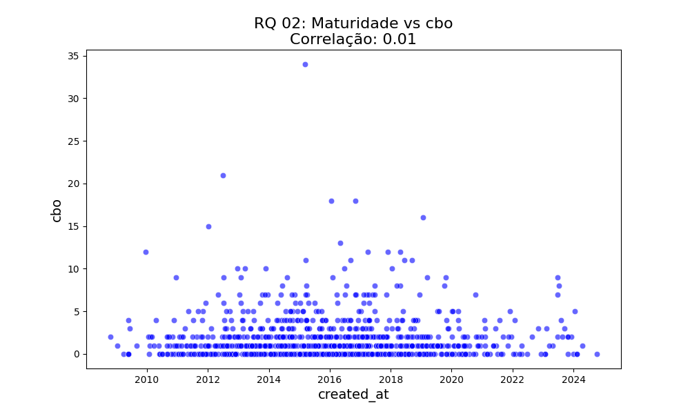
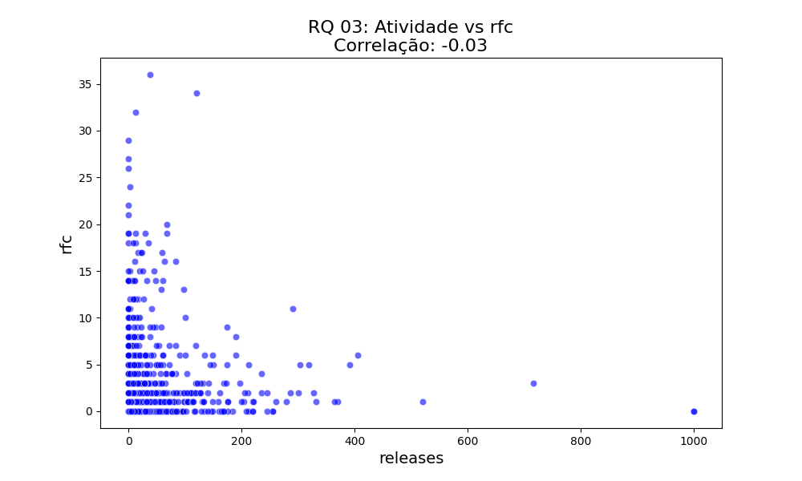
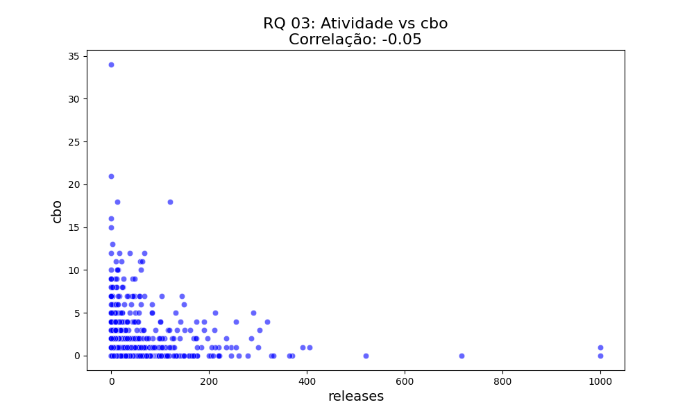
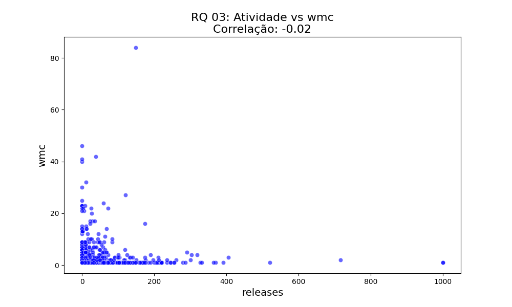
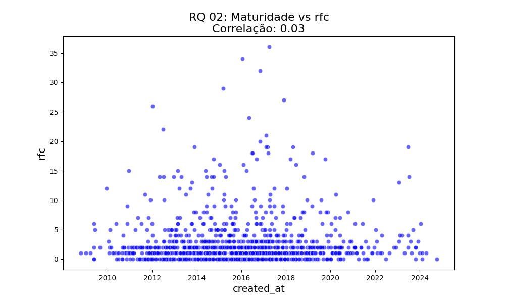
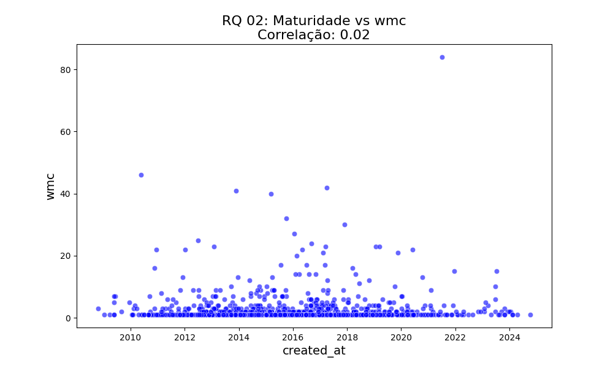
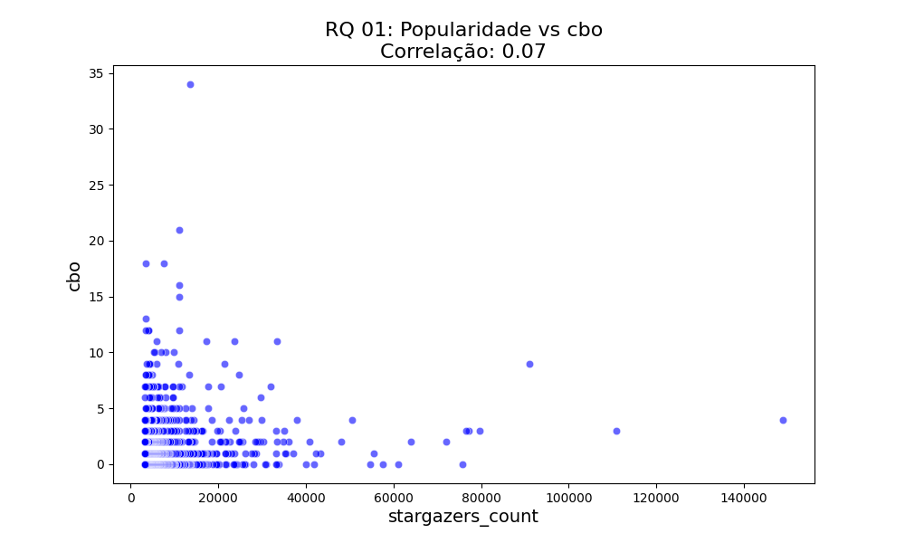
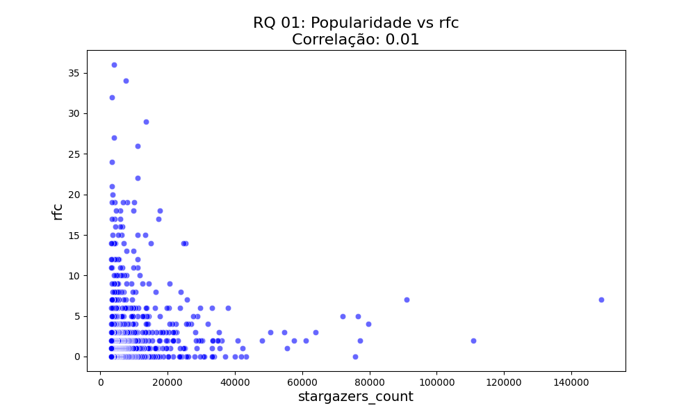
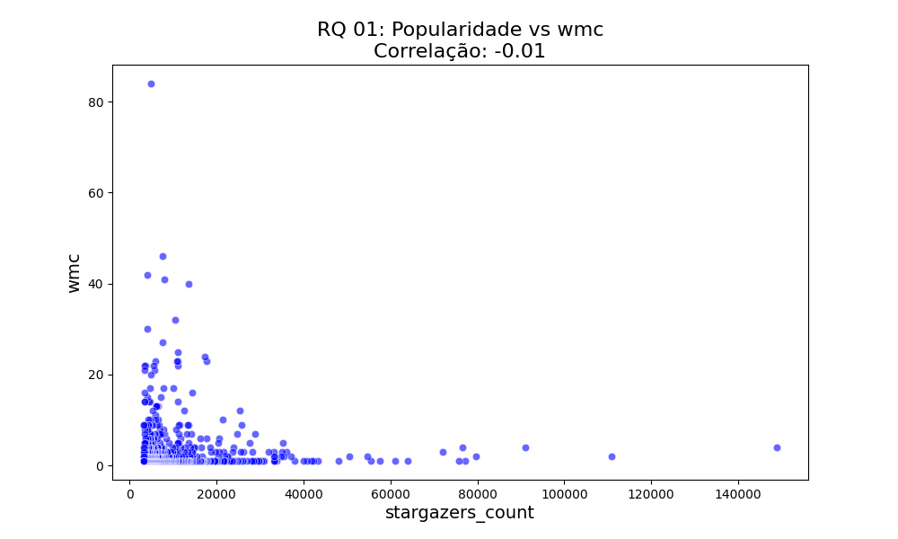

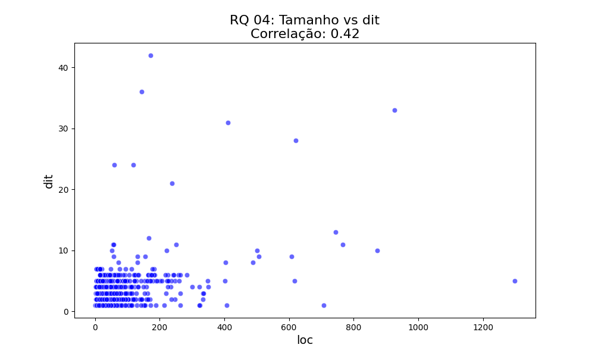
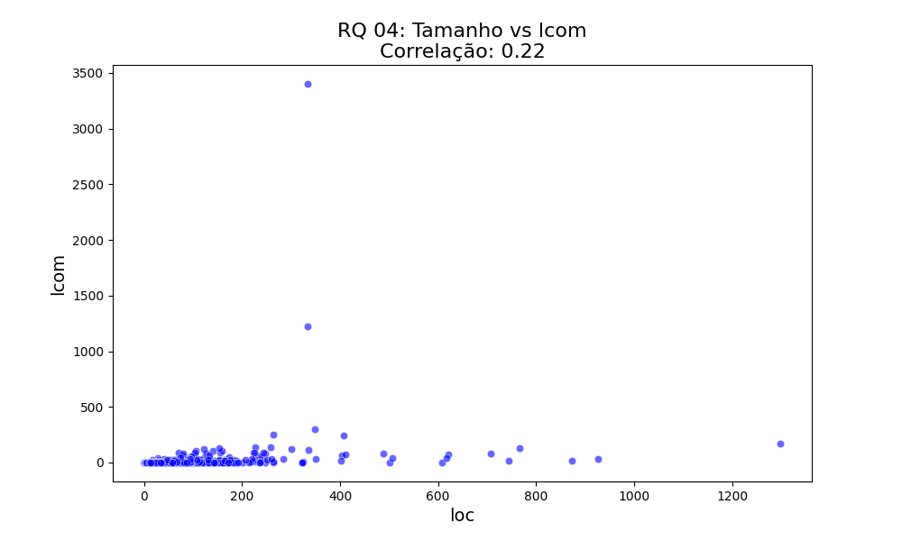

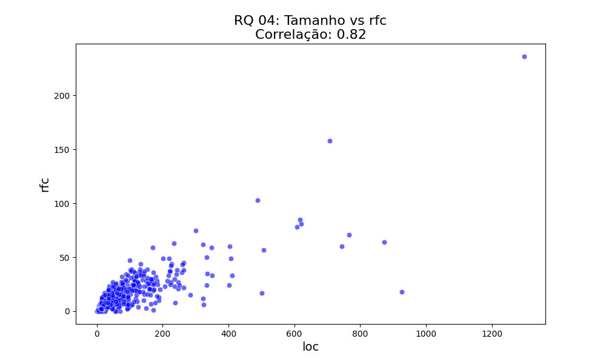
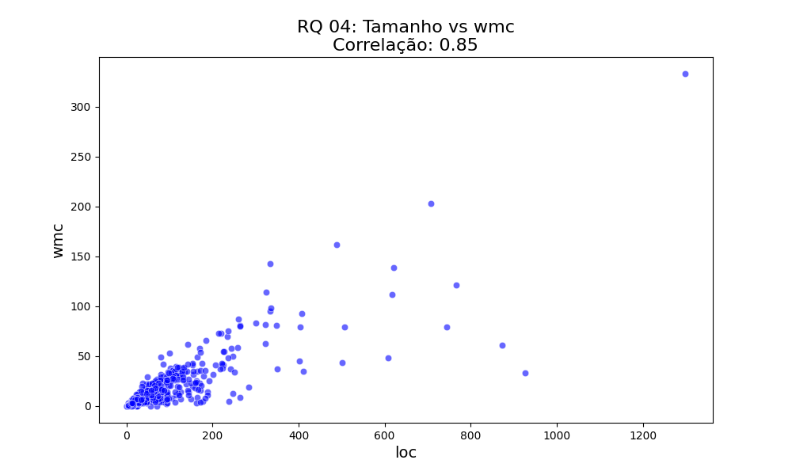

---

Resultados

---
